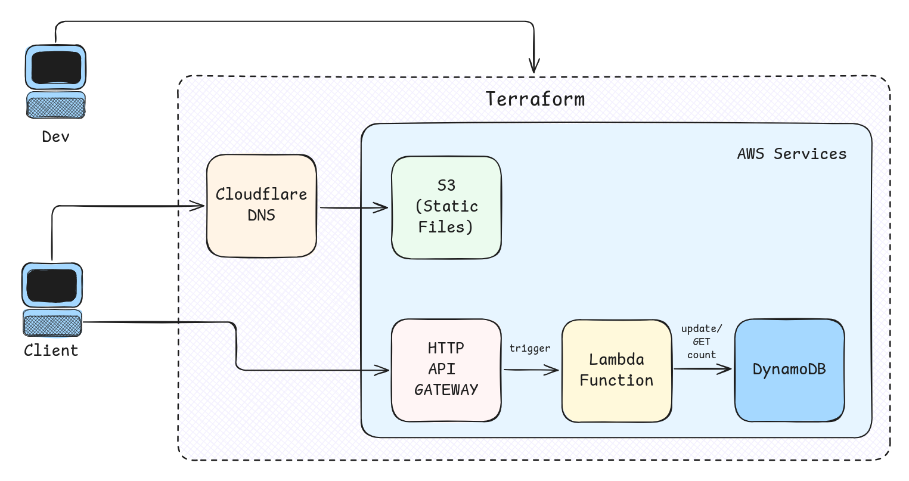

# Completing the AWS Cloud Resume Challenge

---

## 📋 Introduction

I recently completed the [AWS Cloud Resume Challenge](https://cloudresumechallenge.dev/docs/the-challenge/aws/) - an excellent hands-on project that combines cloud infrastructure, serverless architecture, and Infrastructure-as-Code (IaC) practices. Here's my journey through the challenge:

---

## 🏗️ Architecture Overview

I used **Excalidraw** (whiteboard tool) to visualize the infrastructure:



**Key Components**:
- **Frontend**: Static website hosted in S3
- **Visitor Counter**: Lambda function triggered via API Gateway
- **Data Storage**: DynamoDB table for view counts
- **DNS Management**: Cloudflare for domain routing
- **IaC**: Terraform for infrastructure provisioning

---

## 🛠️ Implementation Steps

### 1. Infrastructure as Code with Terraform
```hcl
# main.tf
module "website" {
    source = "./modules/website"

    aws_region           = var.aws_region
    site_folder          = var.site_folder
    site_index_file      = var.site_index_file
    site_error_file      = var.site_error_file
    site_domain          = var.site_domain
    cloudflare_api_token = var.cloudflare_api_token
    cloudflare_zone_id   = var.cloudflare_zone_id
}

module "function" {
    source              = "./modules/function"
    aws_region          = var.aws_region
}
```
- **Function Module**: Creates Lambda, API Gateway, and DynamoDB
- **Website Module**: Configures S3 bucket and Cloudflare DNS

### 2. Serverless Backend
```python
// function.py
import json
import boto3
from decimal import Decimal

class DecimalEncoder(json.JSONEncoder):
    def default(self, obj):
        if isinstance(obj, Decimal):
            return int(obj)
        return super().default(obj)

dynamodb = boto3.resource('dynamodb')
table = dynamodb.Table('countdb')

def set_headers(response):
    response['headers'] = {
        'Access-Control-Allow-Origin': '*',
        'Access-Control-Allow-Methods': 'GET',
        'Access-Control-Allow-Headers': 'Content-Type',
        'Content-Type': 'application/json'
    }
    return response

def handler(event, context):
    try:
        # Get current view count
        response = table.get_item(Key={'id': '1'})
        current_views = response.get('Item', {'views': 0}).get('views', 0)
        
        # Increment count
        new_views = current_views + 1
        table.put_item(Item={'id': '1', 'views': new_views})
        
        # Return response
        return set_headers({
            'statusCode': 200,
            'body': json.dumps({'views': new_views}, cls=DecimalEncoder)
        })
        
    except Exception as e:
        return set_headers({
            'statusCode': 500,
            'body': json.dumps({'error': f'Internal error: {str(e)}'})
        })
```
- Lambda function updates DynamoDB counter on each API call
- API Gateway provides HTTPS endpoint

### 3. Frontend Implementation
```typescript
// getViews.ts
export async function getViews(): Promise<number> {
  try {
    const response = await fetch(API_URL, {
      method: 'GET',
      mode: 'cors',
      headers: {
        'Accept': 'application/json',
        'Origin': window.location.origin,
      },
      credentials: 'omit'
    });
    
    if (!response.ok) {
      console.error('API Error:', response.status, response.statusText);
      throw new Error('Network response was not ok');
    }
    
    const data = await response.json();
    return data.views;
  } catch (error) {
    console.error('Error fetching view count:', error);
    return 0;
  }
}
```
- Static site built with Next.js
- Fetches count from API Gateway endpoint
- Automated deployment via Terraform

---

## 🔑 Key Learnings

1. **Infrastructure as Code Power**:
   - Terraform enabled reproducible environment setup
   - Modular structure simplified component management

2. **Serverless Benefits**:
   - Cost-effective scaling with Lambda
   - Managed services reduced operational overhead

3. **CI/CD Foundations**:
   - Automated deployments via Terraform workflows
   - Version-controlled infrastructure changes

---

## 🚀 Try It Yourself!

1. Clone the repository:
```bash
git clone https://github.com/nuanv/CRC-AWS.git
```

2. Deploy infrastructure:
```bash
terraform apply -target=module.function
terraform apply -target=module.website
```

3. Visit your personalized resume site:
`https://your-domain.com`

---

## 📈 Results


The final implementation features:
- 100% serverless architecture
- Global accessibility via Cloudflare DNS
- Cost under $1/month
- Automated infrastructure provisioning

---

## 🔗 Resources
- [Official Challenge Documentation](https://cloudresumechallenge.dev/docs/the-challenge/aws/)
- [Project GitHub Repository](https://github.com/nuanv/CRC-AWS)
- [Terraform AWS Provider Docs](https://registry.terraform.io/providers/hashicorp/aws/latest/docs)

*Special thanks to the Cloud Resume Challenge creators for this excellent learning opportunity!*